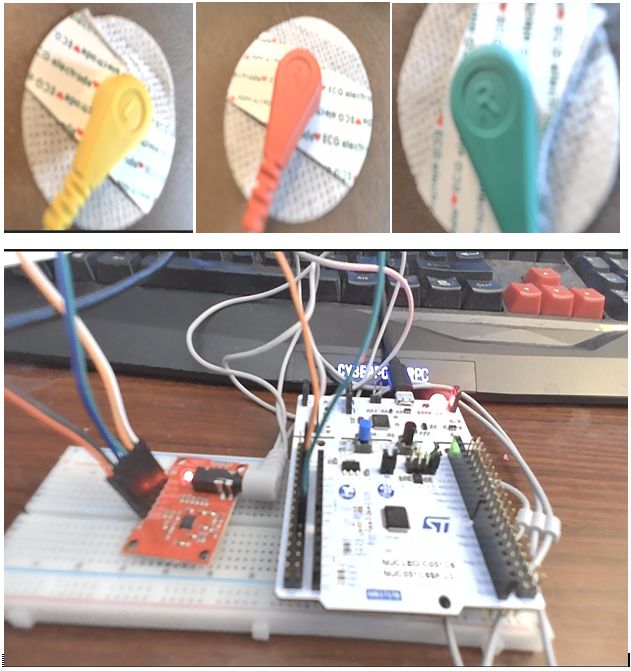
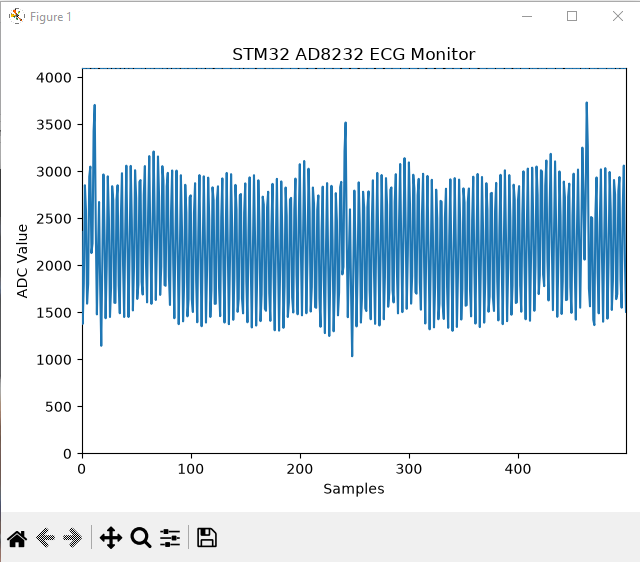

# STM32 AD8232 Real-Time ECG Monitor

A real-time ECG acquisition and visualization project built using an STM32C031C6 microcontroller and an AD8232 ECG analog front-end module.

The system acquires the analog ECG signal using the STM32's 12-bit ADC, samples the signal at 250 Hz using TIM3, transmits the ADC samples to a computer through USART2, and displays the incoming signal in real time using Python and Matplotlib.

## Project Overview

The signal path is:

**ECG Electrodes → AD8232 → STM32 ADC → TIM3 → USART2 → USB/ST-LINK → Python → Live Plot**

The project demonstrates embedded-system concepts including:

- Analog-to-Digital Conversion (ADC)
- Hardware timers and interrupts
- UART/USART serial communication
- Real-time sensor data acquisition
- STM32 HAL programming
- Python serial communication
- Real-time data visualization

## Hardware

- STM32C031C6 development board
- AD8232 ECG module
- Three ECG electrodes
- ECG electrode cable
- Breadboard
- Jumper wires
- USB cable
- Computer

## Hardware Setup



The analog output of the AD8232 is connected to the STM32 ADC input.

The ECG electrodes acquire the biopotential signal, while the AD8232 performs analog front-end signal conditioning before the signal is sampled by the STM32.

## STM32 Configuration

### ADC1

- Resolution: 12-bit
- Input: ADC Channel 0
- Conversion range: 0–4095
- Conversion mode: Single conversion

### TIM3

TIM3 generates the sampling interval.

- Timer clock: 12 MHz
- Prescaler (PSC): 47
- Auto-reload register (ARR): 999
- Sampling frequency: 250 Hz

The sampling frequency is calculated as:

`12,000,000 / ((47 + 1) × (999 + 1)) = 250 Hz`

### USART2

- Mode: Asynchronous
- Baud rate: 115200 bits/s
- Data bits: 8
- Stop bits: 1
- Parity: None
- Hardware flow control: None

USART2 sends the ADC samples from the STM32 to the computer.

## Software

### STM32

The embedded firmware was developed using:

- STM32CubeMX
- STM32CubeIDE
- STM32 HAL

The firmware:

1. Initializes ADC1, TIM3, and USART2.
2. Uses TIM3 to establish a 250 Hz sampling interval.
3. Reads the AD8232 output through ADC1.
4. Converts the ADC measurement into serial data.
5. Sends each sample through USART2.

### Python ECG Plotter

The `ecg_plotter.py` program receives the ADC measurements through the ST-LINK Virtual COM Port.

Python libraries used:

- PySerial
- Matplotlib

The application displays the incoming samples continuously as a live waveform.

## Real-Time Signal Visualization



The graph above demonstrates real-time acquisition and visualization of the AD8232 output.

The current prototype may contain electrical noise and motion artifacts. It is intended to demonstrate ECG signal acquisition and embedded data processing rather than provide clinical-quality ECG measurements.

## Repository Structure

```text
STM32_ECG_Monitor/
├── Core/
│   ├── Inc/
│   └── Src/
├── Drivers/
├── Images/
│   ├── ecg_connection.PNG
│   └── ecg_display.PNG
├── ecg_plotter.py
├── STM32_ECG_Monitor.ioc
├── README.md
└── .gitignore